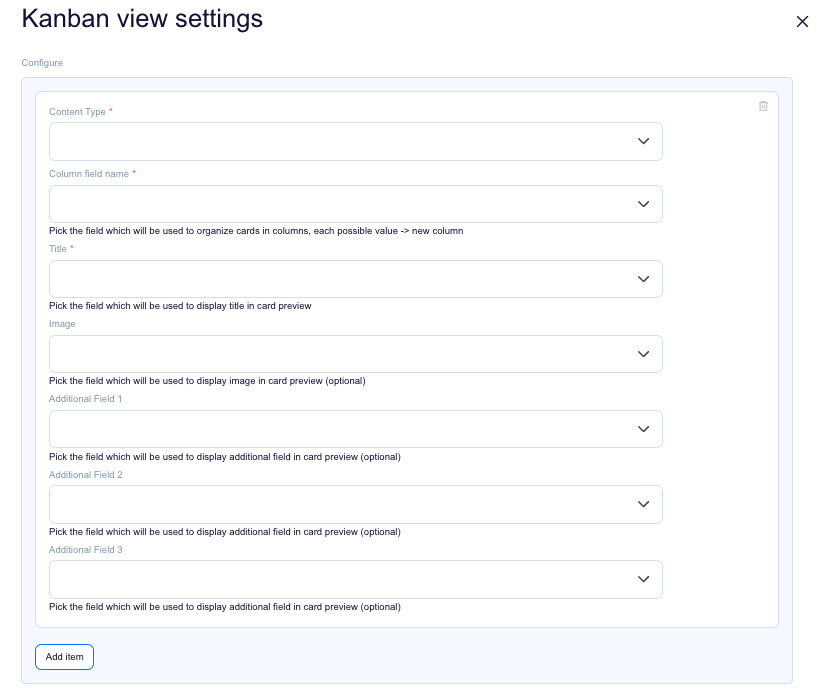

# Example Flotiq Plugin in React

## Quickstart:

1. `yarn`
2. `yarn start`
3. work work work
4. update your `src/plugin-manifest.json` file to contain the production URL and other plugin information
5. `yarn build`
6. paste js code from `./build/static/js/main.xxxxxxxx.js` to Flotiq console
7. navigate to affected Flotiq pages

## Usage

### Overview

This plugin transforms the default Flotiq `content-type-objects` page into a `Kanban board`, where content objects are
displayed as cards within their respective columns.

### Configuration

The plugin requires you to select a `Content type definition` that will be converted into a `Kanban board`. You also
need to choose a field of type `Select` or `Radio`, which will determine the Columns on the board. Additionally, select
a `text`field that will serve as the `title` displayed on `each card`.



Additionally, the plugin lets you configure optional fields to be displayed on the card, such as an `image` or up to
three `additional fields` shown at the `bottom of the card`. supported types for 
`additional fields`: `text, number, select, date, checkbox, radio`

## Deployment

<!-- TO DO -->

## Loading the plugin

### URL

1. Open Flotiq editor
2. Open Chrome Dev console
3. Execute the following script
   ```javascript
   FlotiqPlugins.loadPlugin('plugin-id', '<URL TO COMPILED JS>')
   ```
4. Navigate to the view that is modified by the plugin

### Directly

1. Open Flotiq editor
2. Open Chrome Dev console
3. Paste the content of `static/js/main.xxxxxxxx.js`
4. Navigate to the view that is modified by the plugin

### Deployment

1. Open Flotiq editor
2. Add a new plugin and paste the URL to the hosted `plugin-manifest.json` file (you can
   use `https://localhost:3050/plugin-manifest.json` as long as you have accepted self-signed certificate for this url)
3. Navigate to the view that is modified by the plugin
